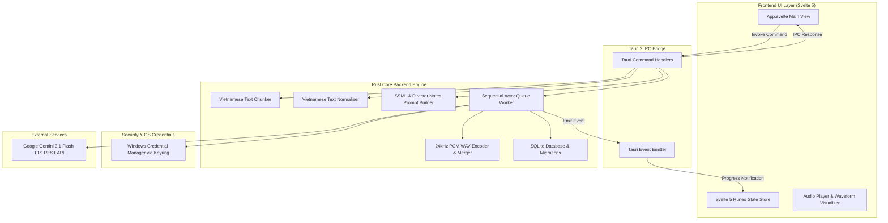

# 🏗️ System Architecture & Engineering Reference

This document provides a comprehensive technical overview of the **Auto TTS Desktop** application, built according to **Google Engineering & Open Source Documentation Standards**.

---

## 1. System Overview

Auto TTS Desktop is a high-performance desktop application for converting long Vietnamese text into high-quality spoken audio using **Google Gemini Interactions REST API**.

The system is designed with a strict isolation barrier between the **Untrusted Frontend UI (Svelte 5 / TypeScript)** and the **Trusted Core Engine (Rust / Tauri 2)**.

---

## 2. Key Modules & Responsibilities

### 2.1 Text Processing Pipeline
- `src-tauri/src/text/normalizer.rs`: Converts raw Vietnamese text containing numbers, dates, times, currencies (`VND`, `USD`, `EUR`), abbreviations (`TP.HCM`, `THPT`, `UBND`), and scientific units (`km/h`, `°C`, `kg`) into spoken natural text.
- `src-tauri/src/text/chunker.rs`: Hierarchical text chunking algorithm prioritizing Heading -> Paragraph -> Sentence -> Clause without breaking words, preserving punctuation and natural pauses.
- `src-tauri/src/text/prompt_builder.rs`: Formats Director Notes (`[DIRECTOR NOTES]` / `<director_notes>`) separated from Transcript (`[TRANSCRIPT]`), with support for SSML parsing (`<break>`, `<emphasis>`, `<prosody>`).

### 2.2 Audio Processing Engine
- `src-tauri/src/audio/pcm_wav.rs`: Encodes raw 24.000 Hz, 16-bit Mono signed little-endian PCM byte stream into standard RIFF WAV headers.
- `src-tauri/src/audio/wav_merger.rs`: Merges multiple WAV segment files atomically with audio spec validation, peak volume scaling normalization (`28000.0 / max_peak`), and custom silence padding.

### 2.3 Queue & Rate Limit Management
- `src-tauri/src/queue/worker.rs`: Tokio-based async Actor loop (`concurrency = 1`) managing sequential requests to Google Gemini API. Handles HTTP `429 Too Many Requests` using Truncated Exponential Backoff with randomized jitter and respects daily quota boundaries (RPD limit).

### 2.4 Security & Storage
- `src-tauri/src/security/keyring_store.rs`: Securely persists the Google Gemini API Key directly inside the **Windows Credential Manager**. API keys are never written to disk files or exposed to JavaScript logs.
- `src-tauri/src/storage/db.rs` & `project_repo.rs`: Embedded SQLite database (`rusqlite`) managing project metadata, segment statuses, and audio cache paths.

---

## 3. Data Flow Sequence

1. **User Text Submission**: User pastes Vietnamese text in Svelte 5 UI.
2. **Text Normalization & Chunking**: Backend executes `VietnameseNormalizer` and `VietnameseChunker` to split text into target 20-30 second blocks.
3. **Queue Enqueue**: Segments are written to SQLite database with `status = "queued"`.
4. **API Request**: Queue Worker fetches API key from `KeyringStore`, formats prompt via `PromptBuilder`, and makes HTTPS POST request to `https://generativelanguage.googleapis.com/v1beta/models/gemini-3.1-flash-tts-preview:generateContent`.
5. **PCM Decoding & Cache**: Raw base64 audio is decoded, validated for duration, converted to WAV, and cached locally.
6. **WAV Merging**: Upon project completion, `wav_merger` combines all segment WAV files into a single master WAV file.
