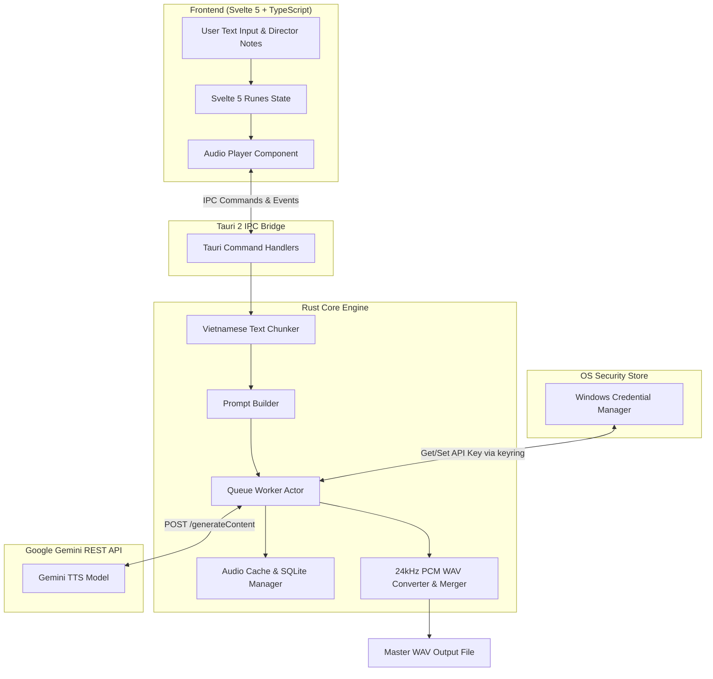

# Auto TTS Desktop 🎙️

Ứng dụng desktop **Auto TTS Desktop** xây dựng bằng **Tauri 2**, **Rust** và **Svelte 5**, hỗ trợ tự động hóa chuyển đổi văn bản tiếng Việt dài thành giọng nói chất lượng cao bằng **Google Gemini Interactions API (Free Tier)**.

   

---

## 🌟 Tính Năng Chính (Core Features)

- 🔑 **Mô hình BYOK (Bring Your Own Key)**: Nhập Gemini API Key cá nhân trong giao diện người dùng, truyền qua kênh IPC cục bộ của Tauri tới Rust backend và lưu giữ an toàn trong **Windows Credential Manager** thông qua crate `keyring`. API Key không được lưu trữ dưới dạng văn bản thuần (plaintext) trong Local Storage, SQLite hay Log tệp.
- ⚡ **Gemini Interactions API**: Sử dụng endpoint chính thức `POST https://generativelanguage.googleapis.com/v1beta/models/{model}:generateContent` hỗ trợ linh hoạt các model `gemini-3.1-flash-tts-preview` và `gemini-2.5-flash-preview-tts`.
- 🎧 **Audio Pipeline Chuẩn 24kHz**: Trích xuất dữ liệu âm thanh Raw PCM 24.000 Hz, 16-bit Mono signed little-endian và đóng gói thành file RIFF WAV bằng crate `hound`.
- ✂️ **Phân Đoạn Văn Bản Tiếng Việt (Text Chunker)**: Chia nhỏ văn bản theo thứ tự ưu tiên Heading -> Paragraph -> Sentence -> Clause mà không cắt giữa từ, giữ nguyên dấu câu và thứ tự tự nhiên.
- 🔄 **Hàng Đợi Tuần Tự (Sequential Queue)**: Đảm bảo độ ổn định cho Free Tier với concurrency = 1, hỗ trợ Truncated Exponential Backoff với randomized jitter, xử lý `Retry-After` header và tự động tạm dừng khi chạm quota ngày.
- 💾 **Quản Lý Project SQLite Local**: Lưu giữ tiến độ và trạng thái các đoạn audio bằng `rusqlite`. Đóng ứng dụng và mở lại không bị mất tiến độ.
- 🔊 **Audio Player & WAV Merger**: Phát trực tiếp từng segment trên giao diện và ghép nối tất cả các đoạn thành 1 file WAV kết quả hoàn chỉnh với khoảng nghỉ silence padding tùy chỉnh và peak volume normalization.

---

## 🏗️ Kiến Trúc Hệ Thống (System Architecture)

> [!NOTE]
> Ứng dụng áp dụng mô hình kiến trúc Async Actor Pattern kết hợp Tauri IPC Bridge giữa Frontend UI và tầng xử lý backend Rust. Các mô hình Gemini TTS hiện ở trạng thái Preview.



---

## 🛠️ Công Nghệ Sử Dụng (Tech Stack)

| Thành phần | Công nghệ | Lý do lựa chọn theo chuẩn Google |
|---|---|---|
| Framework Desktop | **Tauri 2 Stable** | Siêu nhẹ, khởi động nhanh, hiệu năng cao, bảo mật cao |
| Backend Engine | **Rust 2021** | An toàn bộ nhớ, xử lý bất đồng bộ mạnh mẽ với `tokio` |
| Frontend UI | **Svelte 5 + TypeScript** | Giao diện hiện đại, phản hồi tức thì, type-safety |
| REST API Client | **Reqwest + Serde** | Gọi Gemini REST API với TLS an toàn |
| Lưu trữ Credentials | **keyring** | Bảo mật API key bằng OS Credential Store (Windows Credential Manager) |
| Database Local | **rusqlite** | SQLite nhúng nhẹ, ổn định, hỗ trợ migrations |
| Đóng gói & Ghép Audio | **hound** | Đọc/ghi và ghép file WAV 24kHz 16-bit chuẩn |

---

## 🎙️ Danh Sách Giọng Đọc Google Gemini TTS Supported

> [!TIP]
> Google Gemini TTS hỗ trợ nhiều chất giọng tự nhiên khác nhau. Bạn có thể chọn voice name tương ứng trong cấu hình Director Notes:

| Voice Name | Giới tính / Âm sắc | Phong cách đọc phù hợp |
|---|---|---|
| `Puck` | Nam (Trầm ấm) | Tin tức, bài giảng, sách nói |
| `Charon` | Nam (Sâu lắng) | Truyện đọc, tài liệu lịch sử |
| `Kore` | Nữ (Truyền cảm) | Sách nói, hướng dẫn viên, tư vấn |
| `Fenrir` | Nam (Mạnh mẽ) | Quảng cáo, thể thao, thuyết minh |
| `Aoede` | Nữ (Nhẹ nhàng) | Thơ văn, thiền định, Podcast |
| `Leda` | Nữ (Rõ ràng) | Đọc tin tức, hướng dẫn kĩ thuật |

---

## 📋 Yêu Cầu Môi Trường (Prerequisites)

Dự án yêu cầu các công cụ sau đã được cài đặt trên hệ thống Windows:

1. **Node.js**: `v20.0.0` trở lên (Khuyến nghị `v24.x`) và `npm`.
2. **Rust Toolchain**: `rustc` và `cargo` `1.90+` (Cài đặt qua `rustup`).
3. **Microsoft C++ Build Tools**: Visual Studio C++ Build Tools (`Microsoft.VisualStudio.Workload.VCTools`) hoặc `LLVM`.
4. **Windows SDK**: `Windows 10/11 SDK`.

---

## 🚀 Hướng Dẫn Chạy Và Đóng Gói

### 1. Khởi chạy ở chế độ Development

```bash
# Cài đặt các thư viện frontend
npm install

# Khởi chạy ứng dụng Tauri ở chế độ phát triển
npm run tauri dev
```

### 2. Kiểm tra Type-check và Unit Test

```bash
# Kiểm tra TypeScript & Svelte syntax
npm run check

# Chạy Unit Tests Rust (Text Chunker, Prompt Builder, Audio Merger, DB, API Parser)
cd src-tauri
cargo test
```

### 3. Đóng gói ứng dụng Windows (.exe)

```bash
npm run tauri build
```

File cài đặt kết quả sẽ được tạo tại:
`src-tauri/target/release/bundle/nsis/Auto TTS Desktop_0.1.0_x64-setup.exe`

---

## 🔑 Hướng Dẫn Lấy API Key Google Gemini

1. Truy cập [Google AI Studio](https://aistudio.google.com/app/apikey).
2. Đăng nhập tài khoản Google của bạn.
3. Chọn **Create API Key** và sao chép mã API Key.
4. Mở ứng dụng **Auto TTS Desktop**, dán API Key vào mục **Bảo mật Gemini API Key** và nhấn **Lưu Key**.

> [!IMPORTANT]
> API Key của bạn chỉ lưu cục bộ trong **Windows Credential Manager** cá nhân và không bao giờ được gửi qua bất kỳ máy chủ trung gian nào ngoài Google Gemini API.

---

## ❓ Khắc Phục Sự Cố (Troubleshooting & FAQs)

| Vấn đề | Nguyên nhân | Cách xử lý |
|---|---|---|
| Lỗi `link.exe not found` khi build | Thiếu C++ Build Tools | Cài đặt "Desktop development with C++" trong Visual Studio Installer |
| Lỗi `HTTP 429 Rate Limited` | Vượt quá giới hạn Free Tier | Hàng đợi tự động hoãn và thử lại. Hãy giữ ứng dụng mở để tự resume |
| Lỗi `Unauthorized (401/403)` | API Key sai hoặc hết hạn | Kiểm tra lại Gemini API Key tại Google AI Studio và lưu lại key |
| Lỗi `Keyring Storage Error` | Dịch vụ Windows Credentials bị tắt | Mở Service Manager và khởi động lại dịch vụ `Credential Manager` |

---

## 📄 Giấy Phép & Đóng Góp (License & Contributing)

Dự án được phát hành theo giấy phép [MIT License](file:///d:/1.%20LapTrinh/TTS%20google/LICENSE). Mọi đóng góp Pull Request cải tiến đều được hoan nghênh!
